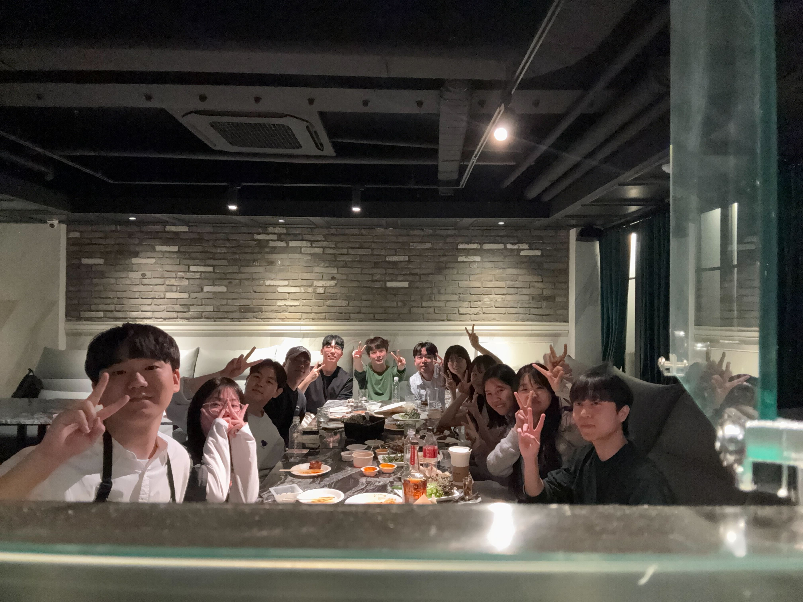
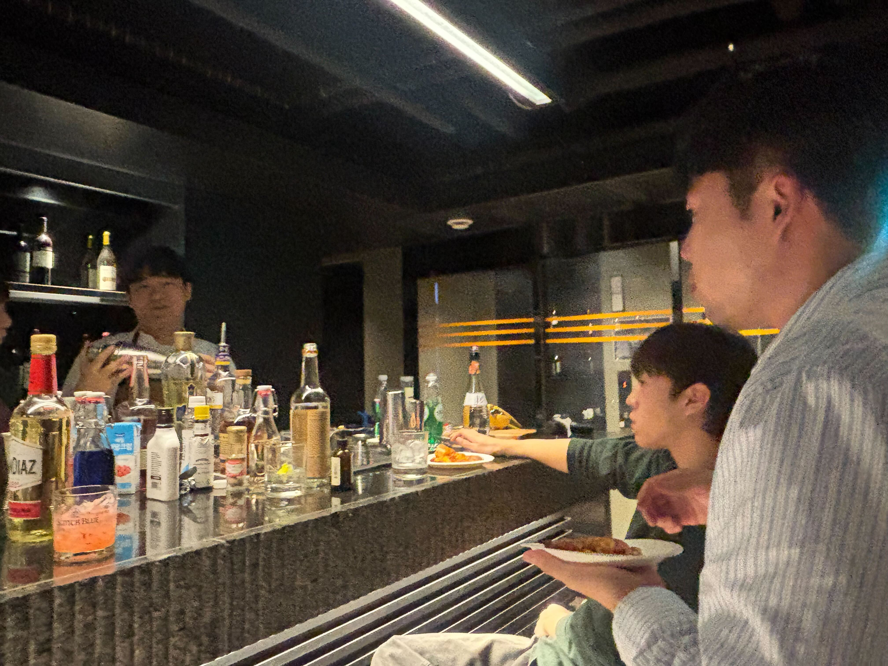
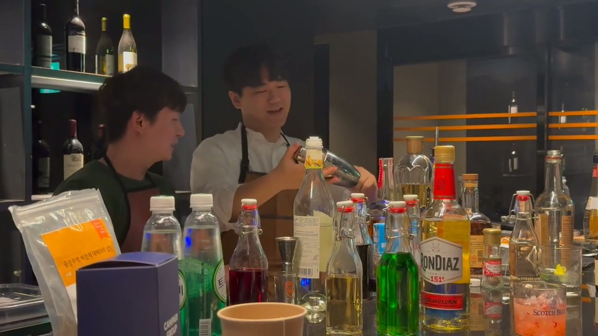
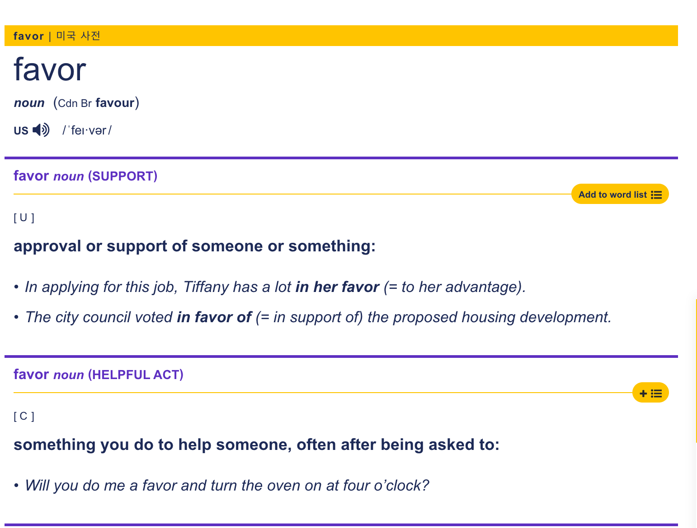
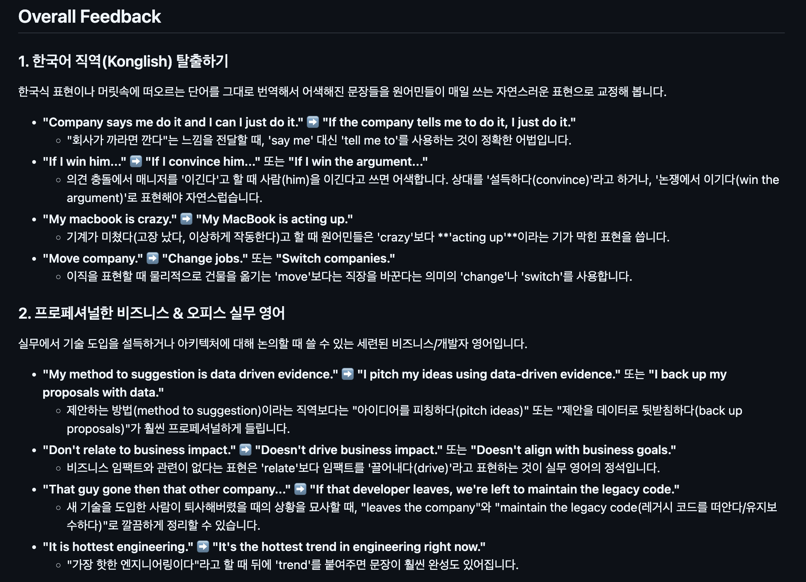

<!-- _class: cover -->

# SIPE in Bay Area

진짜로 실리콘 밸리에 SIPE 만드는 그날을 위하여

권혁준 · 김나정 · 김범석 · 김은혜 · 박도륜 · 이정민 · 유지예 · 최지원

---

# 미션 목표

개발 실무에 필요한 영어 읽기와 말하기를 함께 공부하는 시간이었습니다.

특히 이런 사람들을 위한 미션으로 기획했습니다.

- 해외 취업에 관심 있는 개발자
- 외국계 기업에서 일해보고 싶은 개발자
- 영어로 개발 문서를 읽고, 영어로 일하는 환경을 경험해보고 싶은 개발자

목표는 완벽한 영어가 아니라, **개발 주제를 영어로 읽고 말해보는 경험을 반복하는 것**이었습니다.

---

# 진행 방식

  

    <strong>30분</strong>
    Article Reading
    
영어 아티클을 세션 안에서 함께 읽었습니다.

  

  

    <strong>10분</strong>
    Break + Review
    
모르는 단어를 찾고 내용을 숙지했습니다.

  

  

    <strong>60분</strong>
    Discussion
    
아티클 주제에 대해 영어로 토론했습니다.

  

  

    <strong>20분</strong>
    Korean Review
    
어려웠던 표현과 문장을 한국어로 리뷰했습니다.

  

---

# 진행 방식

  

    X
    <strong>English-only</strong>
    
Review Session 외에는 번역기와 LLM을 사용하지 않았습니다.

  

  

    X
    <strong>Dictionary-only</strong>
    
모르는 단어는 Cambridge Dictionaries 영영사전만 사용했습니다.

  

  

    X
    <strong>Korean Chance</strong>
    
토론 중 한국어는 1회, 최대 10초만 허용했습니다.

  

  

    O
    <strong>GitHub Notes</strong>
    
매주 어떤 주제로 이야기했는지 주차별 노트로 기록했습니다.

  

  

    O
    <strong>Expression Review</strong>
    
막혔던 표현과 어색한 직역 표현을 리뷰 세션에서 정리했습니다.

  

  

    O
    <strong>Zoom Study</strong>
    
정규 세션 외에도 팀원들이 자발적으로 업무 표현을 복습했습니다.

  

---

# 주차별 진행 주제

  

    <strong>Week 1</strong>
    <em>Self Introduction</em>
    자기소개를 하고, My Dream Company의 Job Description을 읽은 뒤 각자 영어로 소개했습니다.
  

  

    <strong>Week 2</strong>
    <em>Code Review</em>
    Google 코드 리뷰 문서를 읽고 AI 코드 리뷰, velocity, 코드 품질, 낮아지는 bus factor, 멘토링 부족을 이야기했습니다.
  

  

    <strong>Week 3</strong>
    <em>Maker's Schedule</em>
    회의가 집중 시간을 어떻게 끊는지, agenda 없는 회의와 context switching cost, AI가 집중의 의미를 바꾸는지 토론했습니다.
  

  

    <strong>Week 4</strong>
    <em>Choose Boring Technology</em>
    새 기술 도입 욕구와 안정적인 기술 선택, business impact, data-driven evidence, over-engineering 사례를 다뤘습니다.
  

  

    <strong>Week 5</strong>
    <em>English Night</em>
    정규 아티클 토론 대신 영어 파티를 열고, 일상적인 주제로 영어 대화를 연습했습니다.
  

  

    <strong>Week 6</strong>
    <em>Retrospective & Presentation</em>
    전체 미션을 회고하고, 발표 내용을 함께 정리하며 마무리했습니다.
  

---

# English Night

  

    
Week 5에는 정규 아티클 토론 대신 <strong>English Night</strong>를 진행했습니다.

    <ul>
      <li>개발 주제가 아닌 일상적인 이야기를 영어로 나눔</li>
      <li>칵테일 주문, 파티룸 대화, casual small talk 연습</li>
      <li>참여자들은 “해외에 있는 것 같았다”고 회고</li>
      <li>기술 영어와 일상 영어는 또 다른 종류의 어려움이 있다는 점을 체감</li>
    </ul>
  

  

    
    
    
  

---

# 진행하면서 겪은 문제

  

    <strong>말이 바로 나오지 않음</strong>
    
생각은 있지만 영어 표현으로 즉시 바꾸는 데 시간이 걸렸습니다.

  

  

    <strong>즉흥 질문 대응</strong>
    
예상치 못한 질문을 받으면 생각을 정리하기 어려웠습니다.

  

  

    <strong>한국어 직역</strong>
    
한국어 표현을 그대로 영어로 옮기면서 어색한 문장이 자주 나왔습니다.

  

  

    <strong>기술 내용과 영어의 이중 부담</strong>
    
아티클 내용을 이해하면서 동시에 영어로 의견을 말해야 했습니다.

  

---

# 해결 과정

  

    <h3>영영 사전으로 의미와 예문 확인</h3>
    
단어를 한국어 뜻으로만 외우지 않고, Cambridge Dictionary를 함께 보면서 의미, 쓰임, 예문을 확인했습니다.

  

  

---

# 해결 과정

  

    <h3>녹음 기반 피드백과 표현 교정</h3>
    
토론 녹음 내용을 Gemini에 넣고 피드백을 요청했습니다. 실제 발화에서 어색했던 문장을 더 자연스러운 표현으로 교정했습니다.

  

  

---

# 회고 및 배운 점

영어는 완벽하게 말하는 것보다 **자신감 있게 말해보는 것**이 중요하다고 느꼈습니다.

그리고 결국 많이 써보는 것이 가장 중요했습니다.

- 틀리더라도 먼저 말해보기
- 매주 조금씩 더 길게 말해보기
- 자주 쓰는 표현을 실제 대화에서 다시 써보기

매주 조금씩 더 말하려고 하는 스터디원들을 보면서 매우 뿌듯했습니다.

**영어를 잘해서 시작한 것이 아니라, 계속 말해보면서 조금씩 나아지는 시간이었습니다.**

---

# 회고 및 배운 점

영어를 쓰는 것도 좋았지만, 그 이상으로 **개발자로서 중요한 주제를 함께 이야기한 시간**이기도 했습니다.

우리는 매주 이런 주제를 다뤘습니다.

- 코드 리뷰
- 시간 관리와 회의 문화
- 기술 스택 선택
- 오버엔지니어링과 비즈니스 임팩트

각자 회사에서 겪은 경험과 고민을 나누면서, 영어 회화뿐 아니라 개발자로서의 관점도 넓힐 수 있었습니다.

**영어 스터디이면서 동시에 개발자들의 실무 경험을 나누는 시간이었습니다.**

---

# Special Session!

For the wrap-up-artifacts, we prepared short summary speech of our weekly discussion!

- How We Code Review
- How We Manage Our Time
- How We Choose Right Tech Stacks

---

# Thanks!
